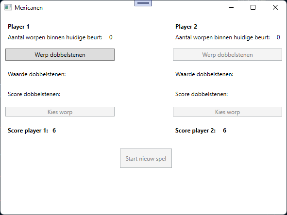
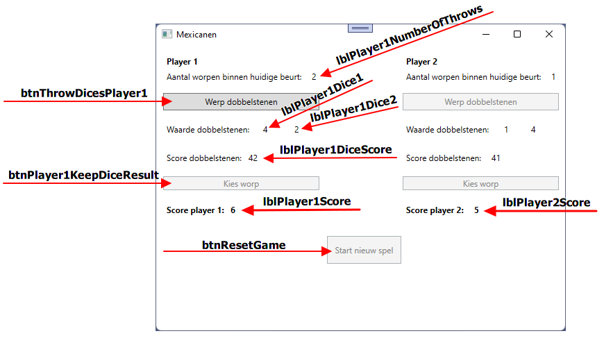
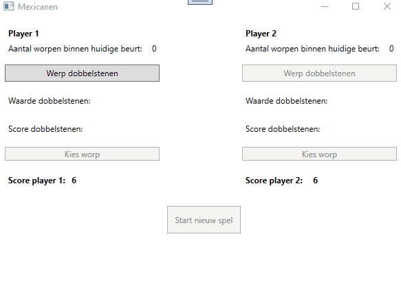

# PE1: Mexicanen dobbelspel
Voor deze eerste opdracht programmeer je een aangepaste versie van het bestaande dobbelspel Mexicanen (soms ook Mexen genoemd).

Dit spel kan normaal gespeeld worden door een ongelimiteerd aantal spelers maar wij gaan het in deze opdracht houden op twee spelers.

Als beide spelers 1 keer zijn geweest noemt men dat "een ronde". Doel per ronde is om niet de laagste score te krijgen.

## Startsituatie

## Controls naamgeving

> De controls voor player 2 hebben dezelfde naam maar dan voor player2 i.p.v. player1. Zie het verschil tussen `lblPlayer1Score` en `lblPlayer2Score` in naamgeving.

## Spelregels
Alle spelers starten met een startscore van 6. De startscore wordt bij het opstarten afgebeeld in de labels `lblPlayer1Score` en `lblPlayer2Score`.  

Daarnaast zijn er twee andere dobbelstenen waarmee wordt gegooid. Player 1 mag altijd beginnen, daarna is player 2 aan de beurt. Per beurt mag elke speler maximum drie worpen uitvoeren.

Player 1 drukt op de button `btnThrowDicesPlayer1`, hierdoor gebruikt hij 1 van de 3 toegestane worpen binnen zijn beurt. Het aantal gebruikte worpen wordt getoond in het label `lblPlayer1NumberOfThrows`. Bij het drukken op de knop worden er 2 random getallen gegenereerd (van 1 t.e.m. 6) die elk de waardes van één dobbelstenen voorstellen. Deze waardes worden voorgesteld in de labels `lblPlayer1Dice1` en `lblPlayer1Dice2`.

De waardes van deze dobbelstenen bepalen dan ook de huidige score van deze worp en wordt getoond in het label `lblPlayer1DiceScore`. Zie verder in deze opgave hoe de score berekend wordt.

Na de eerste worp in de beurt van player 1 heeft deze speler twee opties; 
- ofwel kiest de speler de worp en gaat de beurt over naar player 2. De speler kan de worp kiezen door te drukken op de button "Kies worp" met de naam `btnPlayer1KeepDiceResult`.
- ofwel werpt player 1 nog eens met de twee dobbelstenen in de hoop een hogere score te gooien. Dit doet de speler door opnieuw te drukken op de button "Werp dobbelstenen" met de naam `btnThrowDicesPlayer1`.

De speler kan per beurt maximum drie worpen uitvoeren. Indien de speler een derde worp uitvoert dan wordt de score berekend van de dobbelstenen in deze derde worp en gaat de beurt over naar de andere speler.

Hierna is het aan player 2 die ook drie worpen binnen zijn beurt kan uitvoeren. De beurt van player 2 is over als:
- player 2 de worp kiest door te drukken op de button "Kies worp" met de naam `btnPlayer2KeepDiceResult`.
- of als player 2 een derde worp heeft uitgevoerd binnen zijn beurt. Dan wordt de score berekend van de dobbelstenen in deze derde worp en wordt bepaald wie deze ronde heeft verloren.

## Bepalen wie een ronde heeft verloren
Op het einde van een ronde wordt bepaald wie de ronde heeft verloren. De speler die de kleinste score heeft van de dobbelstenen krijgt 1 punt minder. Indien beide spelers dezelfde score hebben dan verliest geen enkele speler een punt. Daarna gaat de beurt terug over naar player 1 (of is het spel ten einde, zie verder in de opgave).

Wanneer een speler een punt verliest wordt dit afgetrokken van de score van de speler. Bijvoorbeeld: indien player 1 de eerste ronde verliest dan verliest hij 1 punt van de 6 punten die hij bij de start van het spel heeft gekregen en houdt de speler nog 5 punten over.

 Deze score wordt voorgesteld in de labels `lblPlayer1Score` en `lblPlayer2Score`.

 Enkele voorbeelden:
|Score dobbelstenen player 1|Score dobbelstenen player 2|Verliezer van de ronde|
|---|---|---|
|61|41|player 2|
|32|41|player 1|
|55|41|player 2|
|55|66|player 1|
|21|41|player 2|
|65|21|player 1|
|21|21|niemand|
|44|44|niemand|
|53|53|niemand|

## Wanneer is het spel afgelopen?
Het spel is afgelopen wanneer een speler geen punten meer heeft. Dit wordt voorgesteld in de labels `lblPlayer1Score` en `lblPlayer2Score`.

Je toont een MessageBox met de melding wie de winnaar is.


## GUI
- Indien player 1 aan de beurt is worden de buttons **enabled** van player 1 en zijn de buttons van player 2 **disabled**.
- Indien player 2 aan de beurt is worden de buttons **enabled** van player 2 en zijn de buttons van player 1 **disabled**.
- Bij het spelen van een spel is de button "Start nieuw spel" met de naam `btnResetGame` **disabled**
- Indien een speler een score heeft van 0 punten is de button "Start nieuw spel" met de naam `btnResetGame` **enabled**


## Score berekenen van 2 dobbelstenen
De score van de twee dobbelstenen wordt als volgt berekend: 

- Als 2 dezelfde getallen worden gegooid dient de waarde van 1 dobbelsteen met 100 vermenigvuldigd te worden om de score te bepalen.
Bijv: de twee dobbelstenen hebben elk een waarde van 4, dan levert dit de score 400 op.
- Als 2 verschillende getallen worden gegooid dan staat het hoogste getal voor tientallen en het laagste getal voor eenheden.
Bijv: er wordt een 3 en een 5 gegooid, dan levert dit de score 53 op.
- Als er een 1 en een 2 gegooid wordt, dit wordt ook wel een **Mexicaantje** genoemd, dan levert deze worp een score op van 1000.

Enkele voorbeelden:

|Dobbelsteen 1|Dobbelsteen 2|Score|
|---|---|---|
|1|6|61|
|6|1|61|
|4|3|43|
|3|4|43|
|6|6|600|
|1|1|100|
|3|3|300|
|2|1|1000|
|1|2|1000|

## Voorbeeld in werking


## Tips
### Willekeurig getal genereren
Een willekeurig getal van 1 t.e.m. 6 kan men als volgt bekomen:

```csharp
Random rnd = new Random();
int randomNumber = rnd.Next(1, 7);
```

### Methodes
Maak zoveel mogelijk gebruik van methodes in je uitwerking.

### Conventies
Volg de [conventies](https://github.com/howest-gp/conventions) van de opleiding Graduaat Programmeren.

## Stappenplan

Aangezien dit jullie eerste PE is, volgt hier een kort stappenplan dat je kan helpen om alles tot een goed einde te brengen.

**Stap 1**: Zet de initiële waarden in alle labels goed

**Stap 2**: De knoppen "Werp dobbelstenen"
Zorg dat de knoppen "Werp dobbelstenen" twee willekeurige getallen kiezen en zet deze waarden in de juiste labels. Kijk zeker eens naar de tip over hoe je willekeurige getallen kunt genereren.

**Stap 3**: Score bepalen
Zorg ervoor dat na het gooien van de dobbelstenen ook de berekende score in het juiste label terecht komt.

**Stap 4**: De huidige speler
Zorg dat je applicatie bijhoudt wie de huidige speler is. Voorzie een methode SwitchPlayer die de huidige speler verandert en de juiste knoppen enabled/disabled. Om deze functionaliteit te testen kun je tijdelijk een extra knop toevoegen aan je wpf applicatie.

Tip: Je kan een variabele `player1Turn` van het type `bool` gaan bijhouden. Wanneer deze `true` is, is het de beurt aan speler 1, wanneer deze `false` is, is het de beurt aan speler 2.

**Stap 5**: Wisselen spelers
Zorg ervoor dat de huidige speler op het juiste moment wisselt. Hiervoor zijn twee mogelijkheden:

- de speler heeft op de knop "Kies worp" geklikt
- de speler heeft drie keer na elkaar gegooid

**Stap 6**: Update scores
Zorg ervoor dat, wanneer een ronde eindigt. De scores voor speler 1 en speler 2 aangepast wordt (de verliezer verliest een punt)

**Stap 7**: End of game
Zorg ervoor dat, wanneer een speler 0 punten heeft, het spel eindigt en dat er de mogelijkheid is om een nieuw spel te starten.
